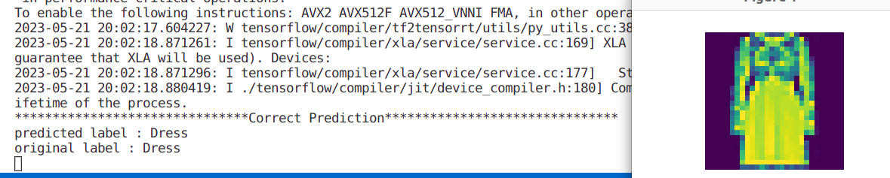
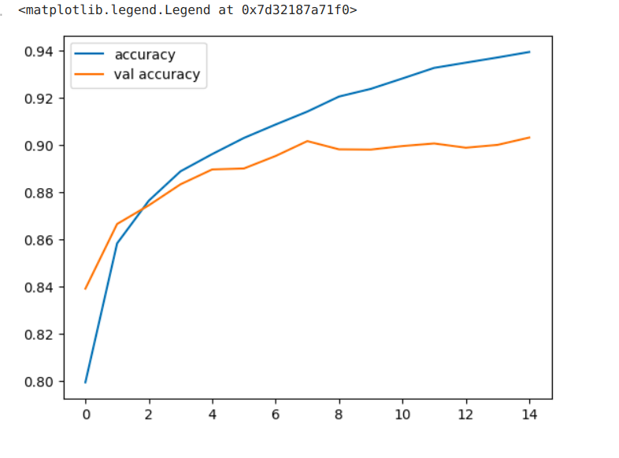

# FashionMNIST-CNN-Classification

This is a simple project of image classification. I trained my CNN model with FashionMNIST dataset using `GPU T4 x2` from kaggle. You can check my kaggle notebook [here](https://www.kaggle.com/code/kavyas1996/fashionmnist-cnn-classification/). My model has top1 accuracy of 90.32% and top5 accuracy of 99%. path to the trained model is :`src/models/` 

## Try this classification model

### Requirements
- numpy, tensorflow

You can try my Classification model(pretrained models) by using following code
```
# in repo's root directory
python3 run.py --idx image_idx
```
- image_idx : FashionMNIST contains 10000 test samples. So you can choose any integer between 0 and 9999.

**example**
```
python3 run.py --idx 1001
```
**output**



## Accuray and Loss 

<div>
  
  
</div>

